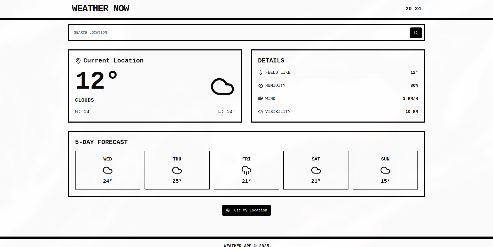

## Getting Started

1. Clone the repository
2. Install dependencies: `npm install` or `pnpm install`
3. Create a `.env.local` file in the root directory with your OpenWeatherMap API key:
   ```
   NEXT_PUBLIC_OPENWEATHER_API_KEY=your_api_key_here
   ```
   (You can copy the `.env.example` file and replace the placeholder with your API key)
4. Build `npm run build`
5. Run the development server: `npm run dev` or `pnpm dev`
6. Open [http://localhost:3000](http://localhost:3000) in your browser

## API Key

This app uses the OpenWeatherMap API. You need to get your own API key from [OpenWeatherMap](https://openweathermap.org/api) and add it to your `.env.local` file as described in the Getting Started section.

